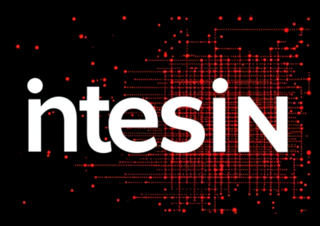
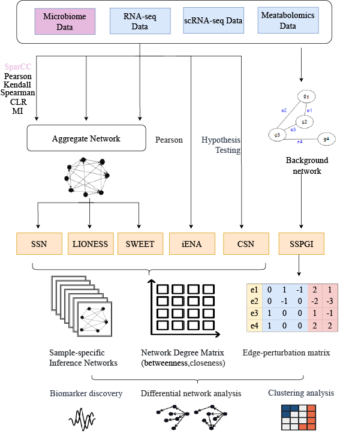

`inteSIN`: integrate sample-specific inference network methods. This package now includes `SSN`, `LIONESS`, `SSPGI`, `iENA`, `CSN` and `Sweet`. The flowchart is below. 

<p align="center"></p>

Contributors
------------

-   [Huahui Ren](https://github.com/rusher321)
-   **Mingyue Zhao**

Comments and contributions
--------------------------

Installation
------------

This package can be installed using [devtools](http://cran.r-project.org/web/packages/devtools/index.html).

``` r
devtools::install_github('rusher321/inteSIN')
```

We welcome comments, criticisms, and especially contributions! GitHub
issues are the preferred way to report bugs, ask questions, or request
new features. You can submit issues here:

<https://github.com/rusher321/inteSIN/issues>

🥶 TODO
------------
- [ ] network visualization
- [ ] degree matrix visualization
- [ ] other SIN methods test on microbiome datasets (CRC; Antibiotic; Infant...)

    - collect 3 CRC cohorts/1 antibiotic/ 1 longitudinal infant (bacteria or virome) cohort and preprocess.
       - the metaphlan3 profiling (XXX et al., XXX et al., ...) from  [curatedMetagenomicData](https://github.com/waldronlab/curatedMetagenomicData).
       - 🦊**low priority**:the virome profiling of infants could be generated using [Phanta](https://www.nature.com/articles/s41587-023-01799-4#additional-information) , the data is in [here](https://www.nature.com/articles/s41587-023-01799-4#additional-information).
    - comparison between biomarkers based on expression data and degree data.
    - performance of classification, the option is [Stabl](https://www.nature.com/articles/s41587-023-02033-x), which could integrate the degree matrix and expression matrix using the data fusion.
    - ...

Meta
----

-   Please [report any issues or
    bugs](https://github.com/rusher321/inteSIN/issues).
-   License: MIT
-   Get citation information for `inteSIN` in R doing
    `citation(package = 'inteSIN')`
-   Please note that this project is released with a [Contributor Code
    of Conduct](CONDUCT.md). By participating in this project you agree
    to abide by its terms.
